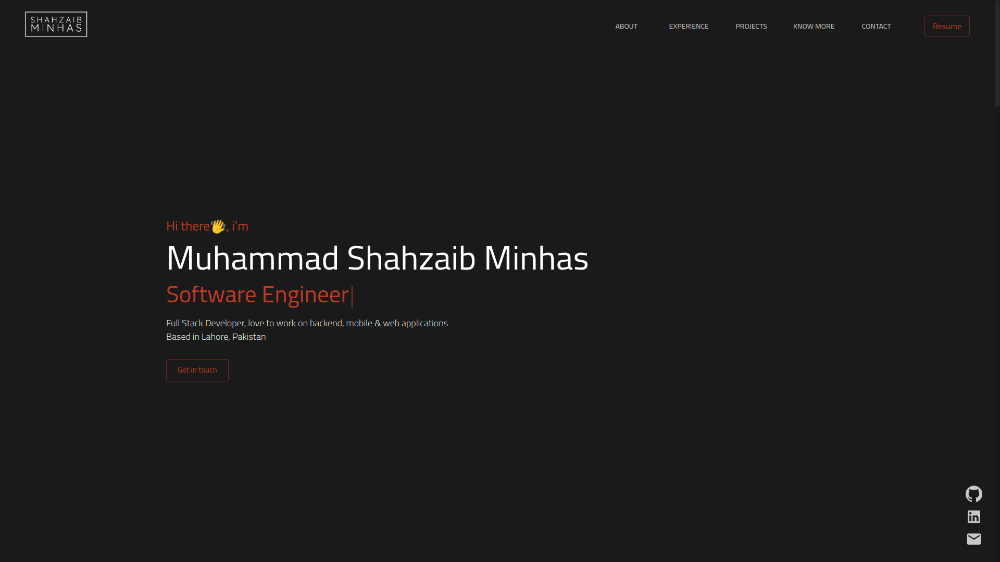
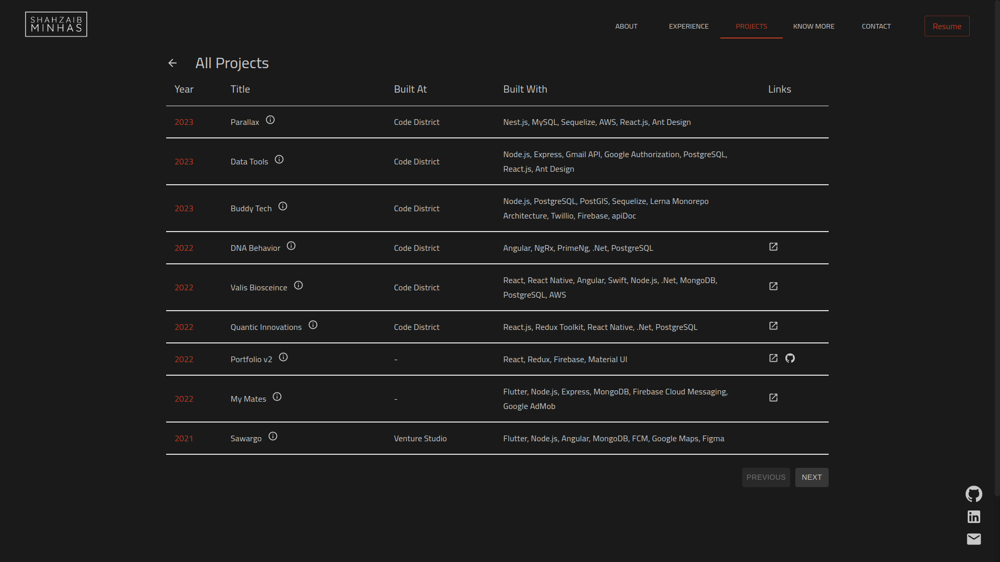
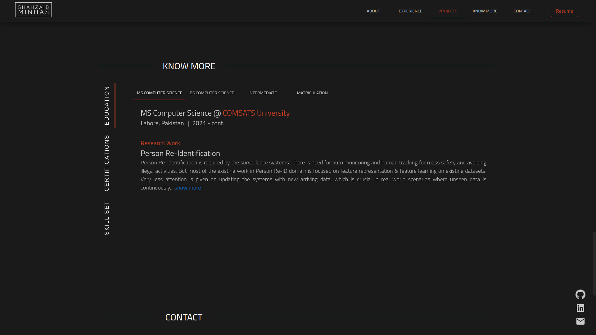
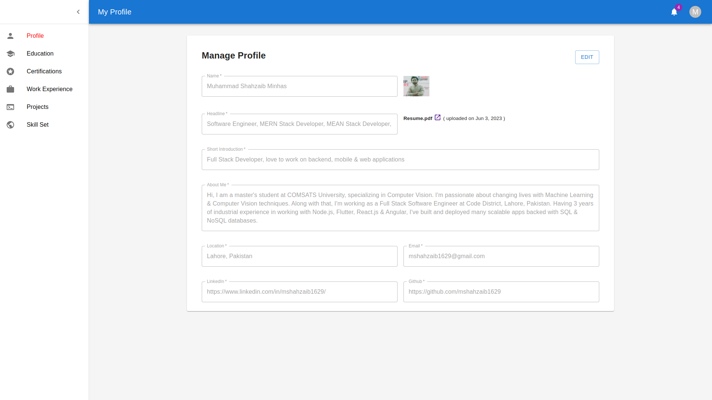

<!-- PROJECT PREVIEW -->
<br />
<p align="center">

  <h1 align="center">Portfolio</h3>

  <p align="center">
    An Awesome, Modern React Portfolio
    <br />
    <br />
    <a href="http://mshahzaib1629.com/">View Demo</a>
    ·
    <a href="https://github.com/mshahzaib1629/portfolio/issues">Report Bug</a>
    ·
    <a href="https://github.com/mshahzaib1629/portfolio/issues">Request Feature</a>
  </p>
</p>

<!-- TABLE OF CONTENTS -->
<details open="open">
  <summary>Table of Contents</summary>
  <ol>
    <li>
      <a href="#about-the-project">About The Project</a>
      <ul>
        <li><a href="#built-with">Forking this project</a></li>
        <li><a href="#built-with">Screenshots</a></li>
        <li><a href="#built-with">Built With</a></li>
      </ul>
    </li>
    <li>
      <a href="#getting-started">Getting Started</a>
      <ul>
        <li><a href="#installation">Installation</a></li>
      </ul>
    </li>
    <li><a href="#contributing">Contributing</a></li>
    <li><a href="#license">License</a></li>
    <li><a href="#contact">Contact</a></li>
  </ol>
</details>

<!-- ABOUT THE PROJECT -->

## About The Project

This portfolio was orignally crafted by <a href="https://www.linkedin.com/in/mehdibha/">Mehdi Bha</a>. My contributions in this project includes:

<ol>
    <li>
      Making this portfolio dynamic
    </li>
    <li>
      Adding Portal to manage dynamic content
    </li>
    <li>
      Adding Education section
    </li>
    <li>
      Adding Certification section
    </li>
    <li>
      Adding Skillset section
    </li>
    <li>
      Redefined listing of Projects & Certificates
    </li>
  </ol>
First version of this project can be found at <a href="https://awesome-portfolio-sepia.vercel.app/" target="_blank">this link</a>. Current version is also live at <a href="https://mshahzaib1629.com/" target="_blank">mshahzaib1629.com</a>

### Forking this project

If someone wants to use this code on his own website, the answer is **YES** BUT please with credits !
We've spent a non-trivial amount of effort building and designing this iteration of this website, and we're proud of it!

### Screenshots

<p align="center">
  <p align="center">Home Section</p>
  
</p>
<br />
<p align="center">
  <p align="center">Redefined Project Section</p>
  
</p>
<br />
<p align="center">
  <p align="center">Paginated Projects Listing</p>
  
</p>
<br />
<p align="center">
  <p align="center">Know More Section</p>
  
</p>
<br />
<p align="center">
  <p align="center">Portfolio Portal</p>
  
</p>
<p align="center">
  <p align="center">Data in Firebase</p>
  
</p>

### Built With

- [React JS](https://reactjs.org/)
- [Material UI](https://material-ui.com/)
- [Framer Motion](https://www.framer.com/motion/)
- [Firebase](https://firebase.google.com/)

<!-- GETTING STARTED -->

## Getting Started

If you want to clone the project and make you personal portfolio

### Installation

1. Clone the repo
   ```sh
   git clone https://github.com/your_username_/Project-Name.git
   ```
2. Install NPM packages
   ```sh
   npm install
   ```
3. You may also need to set these Environment Variables
   ```sh
   REACT_APP_FIREBASE_API_KEY = ""
   REACT_APP_FIREBASE_AUTH_DOMAIN = ""
   REACT_APP_FIREBASE_PROJECT_ID = ""
   REACT_APP_FIREBASE_STORAGE_BUCKET = ""
   REACT_APP_FIREBASE_MESSAGING_SENDER_ID = ""
   REACT_APP_FIREBASE_APP_ID = ""
   REACT_APP_FIREBASE_MEASUREMENT_ID = ""
   ```

<!-- CONTRIBUTING -->

## Contributing

Contributions are what make the open source community such an amazing place to learn, inspire, and create. Any contributions you make are **greatly appreciated**.

1. Fork the Project
2. Create your Feature Branch (`git checkout -b feature/AmazingFeature`)
3. Commit your Changes (`git commit -m 'Add some AmazingFeature'`)
4. Push to the Branch (`git push origin feature/AmazingFeature`)
5. Open a Pull Request

<!-- LICENSE -->

## License

Distributed under the MIT License. See `LICENSE` for more information.

<!-- CONTACT -->

## Contact

M. Shahzaib Minhas - [linkedIn](https://www.linkedin.com/in/mshahzaib1629/) - mshahzaib1629@gmail.com <br>
Mehdi Ben Hadj Ali - [linkedIn](https://www.linkedin.com/in/mehdibha/) - mehdibenhadjali@gmail.com

<!-- MARKDOWN LINKS & IMAGES -->
<!-- https://www.markdownguide.org/basic-syntax/#reference-style-links -->

[contributors-shield]: https://img.shields.io/github/contributors/Mehdi-BHA/Awesomefolio.svg?style=for-the-badge
[contributors-url]: https://github.com/Mehdi-BHA/Awesomefolio/graphs/contributors
[forks-shield]: https://img.shields.io/github/forks/Mehdi-BHA/Awesomefolio.svg?style=for-the-badge
[forks-url]: https://github.com/Mehdi-BHA/Awesomefolio.svg/network/members
[stars-shield]: https://img.shields.io/github/stars/Mehdi-BHA/Awesomefolio.svg?style=for-the-badge
[stars-url]: https://github.com/Mehdi-BHA/Awesomefolio.svg/stargazers
[issues-shield]: https://img.shields.io/github/issues/Mehdi-BHA/Awesomefolio.svg?style=for-the-badge
[issues-url]: https://github.com/Mehdi-BHA/Awesomefolio.svg/issues
[license-shield]: https://img.shields.io/github/license/Mehdi-BHA/Awesomefolio.svg?style=for-the-badge
[license-url]: https://github.com/Mehdi-BHA/Awesomefolio.svg/blob/master/LICENSE.txt
